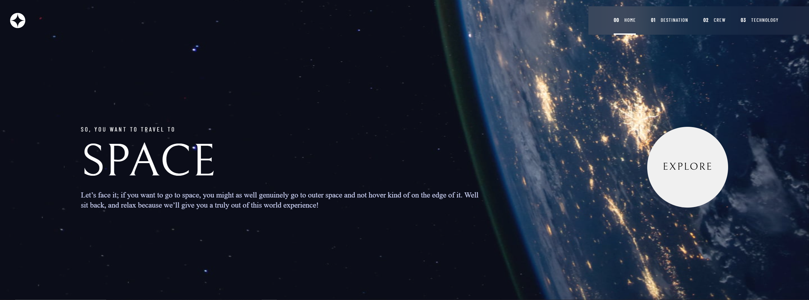
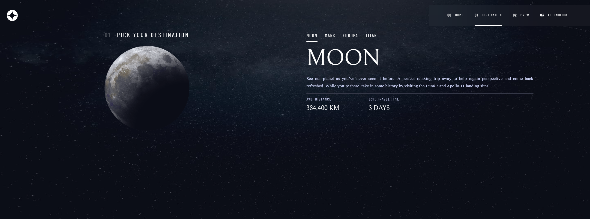
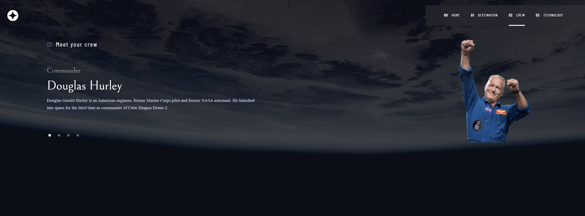
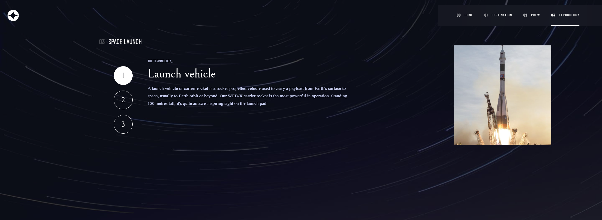

<h1 align="center">Space-tourism</h1>

<p align="center">Site desenvolvido para um desafio do site FrontendMentor.

</p>

# TECNOLOGIAS 
<ul>
  <li>react</li>
  <li>axios</li>
  <li>next</li>
  <li>react-icons</li>
  <li>styled-components</li>
  <li>typescript</li>
</ul>


#CONFIGURAÇÃO DO PROJETO
```
# Abra o terminal e clone o repositório com o comando
git clone https://github.com/rodrigopfialho/space-tourism

No terminal digite os seguintes comando.

npm i

npm run dev
```
<span>O projeto estará disponivel no  http://localhost:3000</span>

<p align="center"> 
    
    
    
    
</p>